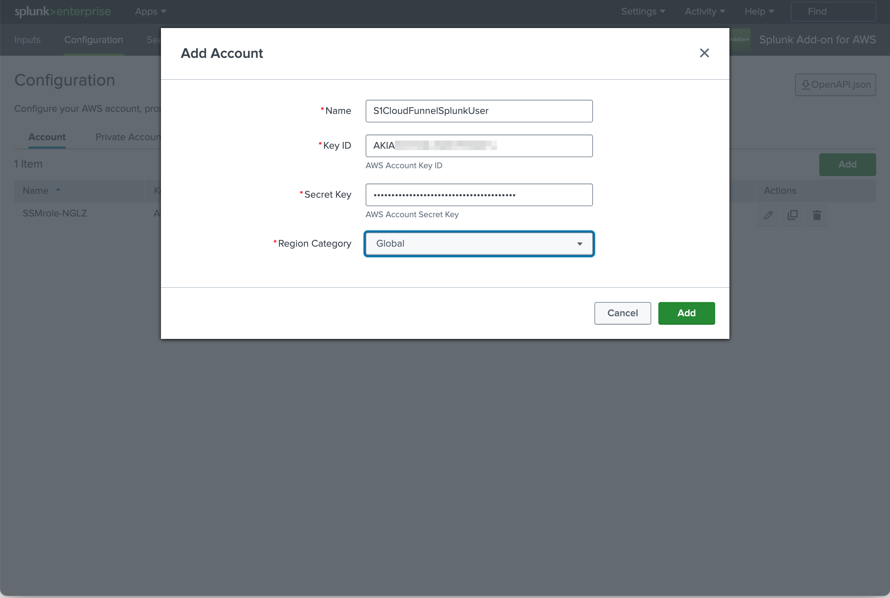
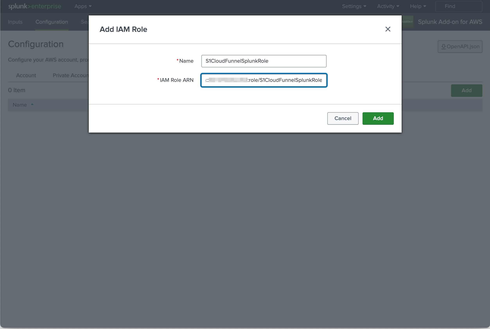
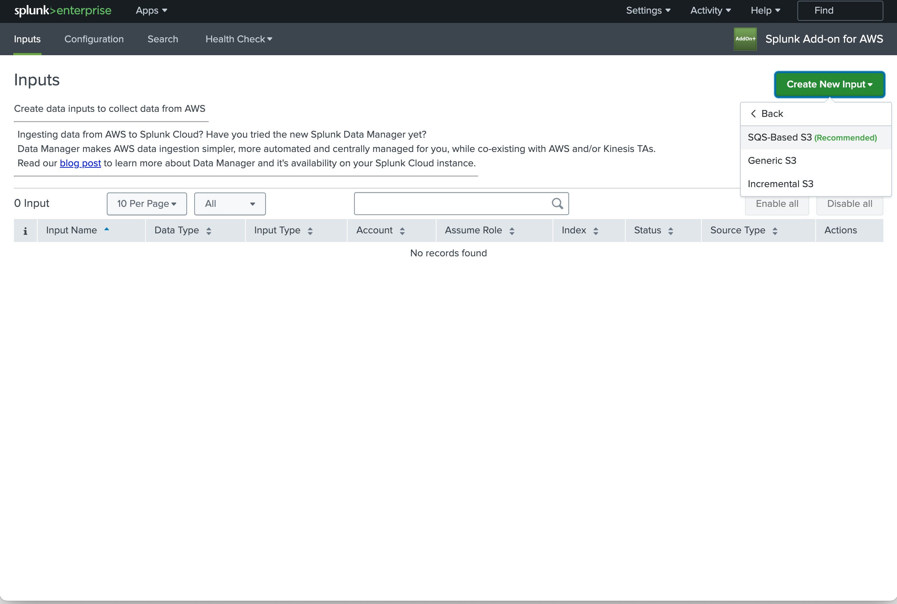
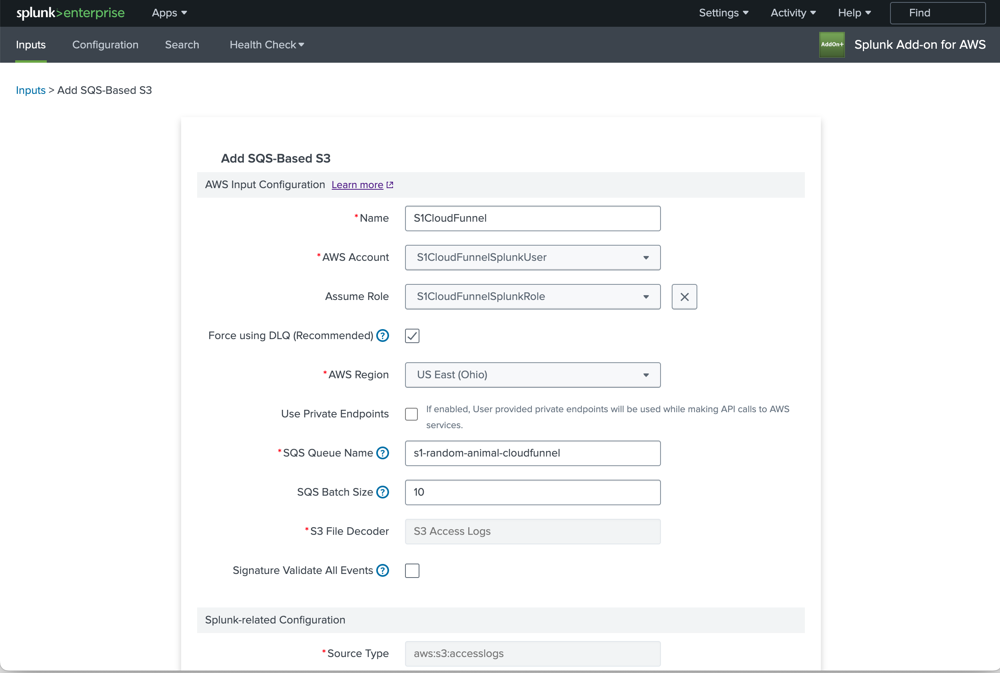
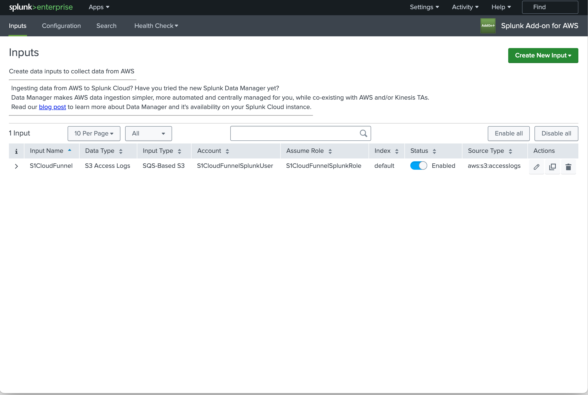

# Sentinel One Deployment and Automation tools for Cloud Funnel 2.0 - Splunk Ingest

Terraform file `splunk.tf` automates IAM resource creation to consume Cloud Funnel 2.0 data using the [Splunk Add-on for AWS](https://splunkbase.splunk.com/app/1876).

To enable this functionality, change:
`terraform.tfvars`

* `sentinelone_create_splunk_iam = "1"`

The IAM resources created are:

* User S1CloudFunnelSplunkUser
* Access Key for User S1CloudFunnelSplunkUser
* Role S1CloudFunnelSplunkRole
  * Attached Policy S1S3CloudFunnelSplunkPolicy
  * Attached Policy S1SQSCloudFunnelSplunkPolicy
  * Attached Policy AmazonSQSReadOnlyAccess

Once the resources are created, follow the steps in [Configure AWS services for the SQS-based S3 input](https://docs.splunk.com/Documentation/AddOns/released/AWS/SQS-basedS3) to onboard.

## Prerequisites

* [Terraform](https://developer.hashicorp.com/terraform/tutorials/aws-get-started/install-cli)
* AWS credentials with permissions to create resources in your target region

## Execution

### Create Resources

```
terraform init
terraform apply
```

### Destroy Resources

```
terraform destroy
```

## Splunk AWS Add-on configuration

### Add AWS Account and Access Key



### Add AWS Role



### Create new SQS-Based S3 Input



### Configure SQS-Based S3 Input



### Save Configuration


